# Probabilistic Atmospheric Spectrum Retrieval for the Ariel Data Challenge 2025
### A Physics-Based Machine Learning Pipeline with Uncertainty Calibration

**Course:** IT3190E — Machine Learning · **Project type:** Group project

**Authors:** _[Member 1], [Member 2], [Member 3], [Member 4]_

---

## Abstract

The Ariel Data Challenge 2025 is a **multi-target probabilistic regression** problem: from noisy telescope detector data, predict an exoplanet's atmospheric transmission spectrum (283 wavelength values) **together with a per-wavelength uncertainty**, scored by a normalized **Gaussian Log-Likelihood (GLL)** that rewards both accuracy *and* well-calibrated confidence.

We build an end-to-end pipeline: detector calibration → light-curve extraction → transit detection → physics-based feature engineering → Target-PCA regression, and benchmark **22 models across 7 families** (linear, Bayesian, kernel/SVM, neighbours, tree ensembles, shallow neural, and deep sequence networks) on the official metric. We formalise **PHC (Physics-conditioned Heteroscedastic Calibration)**, an uncertainty-calibration framework with a closed-form per-wavelength GLL optimum, and we evaluate deep sequence models (CNN1D/TCN/LSTM/GRU/Transformer/Autoencoder) on raw light curves.

Our headline findings, established through a **protocol-synchronized comparison**, are: (1) **tree ensembles win** the official metric (extra_trees 0.287, random_forest 0.273 GLL) with deep CNN/Transformer close behind (~0.22); the earlier impression that "deep wins" was a **protocol artifact**; (2) **uncertainty quality gates the score** — every point-estimator (including XGBoost with the *best* RMSE) scores GLL = 0 because its uncertainty is uninformative; (3) PHC is a **principled but empirically marginal** method — the models' intrinsic uncertainty is already adequate; and (4) the score depends strongly on dataset size (GLL ≈ 0 below ~800 planets). We report these honestly, including the negative results.

---

## Table of Contents
1. Introduction
2. Problem Formulation
3. Background & Related Work
4. Data & Exploratory Analysis
5. Methodology
6. Experiments & Results
7. Discussion & Findings
8. Limitations & Future Work
9. Conclusion
10. Contributions & Reproducibility
11. References
12. Appendix

---

## 1. Introduction

The ESA *Ariel* mission will observe ~1,000 exoplanets via **transit spectroscopy**: when a planet crosses in front of its host star, a wavelength-dependent fraction of starlight is absorbed by the planet's atmosphere, imprinting an **atmospheric spectrum** on the observed light curve. Recovering this spectrum reveals atmospheric composition, but the signal is extremely weak and buried in instrumental and photon noise.

The Ariel Data Challenge 2025 (NeurIPS) frames this as a supervised learning task. Crucially, the competition does **not** grade a point estimate alone — it grades a **probability distribution** over each wavelength. A model must therefore output a mean spectrum **and a credible uncertainty**, and is penalised both for being wrong and for being **over- or under-confident**. This makes the problem a genuine *probabilistic regression*, where uncertainty quantification is a first-class objective rather than an afterthought.

**Task.** Given noisy detector signals for a planet, predict 283 spectral values $\mu_\lambda \approx (R_p/R_s)^2$ and 283 uncertainties $\sigma_\lambda$.

### 1.1 Contributions

1. **An end-to-end physics-based pipeline** (detector calibration → light curves → transit detection → physics feature engineering → Target-PCA modelling), implemented as a reusable, tested library.
2. **A systematic benchmark of 22 models across 7 families** evaluated on the *official* Ariel GLL metric on identical cross-validation folds.
3. **A principled uncertainty-calibration framework, PHC** (Physics-conditioned Heteroscedastic Calibration), with a **closed-form GLL-optimal** per-wavelength scale. We use it to *standardise* uncertainty across models for a fair comparison, and we report its empirical effect honestly — it turns out to be a **diagnostic** finding (intrinsic model uncertainty is already adequate) rather than a performance booster.
4. **Deep sequence baselines** (CNN1D, TCN, LSTM, GRU, Transformer, Autoencoder+MLP) trained directly on calibrated light curves.
5. A **protocol-synchronized ML-vs-Deep comparison** and an honest discussion of findings, **including negative results** (PHC, mean/shape decomposition) — which we argue is itself a methodological contribution.

> Note on emphasis: our strongest results are the **systematic metric-faithful benchmark**, the **fair synchronized comparison**, and the **"uncertainty-quality gates the score" finding**. PHC is presented as a theoretically-grounded framework and an analysis tool, not as a method that improves the score.

---

## 2. Problem Formulation

### 2.1 Inputs and outputs

| Component | Role |
|---|---|
| AIRS-CH0 signal | Spectrometer detector `[time, spatial, wavelength]` → spectral information |
| FGS1 signal | White-light photometer → high-SNR transit timing/shape |
| Calibration files | Dead-pixel map, dark frame, flat field |
| ADC info | Gain/offset for raw-signal correction |
| Star info | Stellar radius, mass, temperature, log g, period |
| `train.csv` | Ground-truth spectra (283 values per planet) |

**Output:** for each planet, $\boldsymbol{\mu}\in\mathbb{R}^{283}$ (mean spectrum) and $\boldsymbol{\sigma}\in\mathbb{R}^{283}$ (per-wavelength standard deviation).

### 2.2 Evaluation metric — normalized Gaussian Log-Likelihood

Each $(\mu,\sigma)$ pair is treated as a 1-D Gaussian over the ground truth $y$. The per-element log-likelihood is

$$
\mathrm{GLL}(y,\mu,\sigma) = -\tfrac{1}{2}\Big(\log(2\pi) + \log\sigma^{2} + \frac{(y-\mu)^2}{\sigma^2}\Big),
$$

summed over all wavelengths and planets to give $L_{\text{pred}}$. The final score is **rescaled to $[0,1]$**:

$$
\text{score} = \mathrm{clip}\!\left(\frac{L_{\text{pred}}-L_{\text{ref}}}{L_{\text{ideal}}-L_{\text{ref}}},\,0,\,1\right),
$$

where $L_{\text{ideal}}$ is a perfect prediction ($\mu=y$) with $\sigma = 10$ ppm $=10^{-5}$, and $L_{\text{ref}}$ is a **naive baseline** that predicts the training-set mean and standard deviation for every element. A score of $0$ means "no better than naive"; $1$ means "ideal". This is implemented as `metrics.ariel_gll_score` (higher is better — the opposite direction to the raw NLL).

**Why this metric is hard.** Because GLL contains both $\log\sigma^2$ and $(y-\mu)^2/\sigma^2$, a model with an accurate mean but a mis-scaled $\sigma$ is heavily penalised. The optimal $\sigma$ must match the *actual* error magnitude; predicting too-wide intervals collapses the score toward the naive baseline (0). As we show in §6–§7, this property dominates the entire study.

> **Sources for the metric:** the official Kaggle metric *"Ariel Gaussian Log Likelihood"* and the NeurIPS 2024 Ariel Data Challenge paper (arXiv:2505.08940).

---

## 3. Background & Related Work

For a transiting planet, the fractional dip in stellar flux during transit equals the squared planet-to-star radius ratio, $d_\lambda = 1 - \tfrac{\text{flux}_{\text{in}}}{\text{flux}_{\text{out}}} \approx (R_p/R_s)^2$, and the **wavelength dependence** of $d_\lambda$ encodes the atmosphere. Thus **transit depth is the single most informative quantity**, and the task reduces to estimating per-wavelength depths from noisy light curves.

Top solutions of previous Ariel challenges share a recipe: heavy **physics-based signal processing** and **light-curve feature engineering** feeding relatively simple, well-regularised regressors, combined with careful **uncertainty calibration** — rather than large end-to-end deep networks, which tend to overfit the limited number of planets. Our design follows this philosophy: invest in physics features and uncertainty, use deep models as comparative baselines, and let the official metric arbitrate.

---

## 4. Data & Exploratory Analysis

We analyse the training targets (~1,100 planets × 283 wavelengths), the stellar metadata, and representative raw light curves. Cross-validation throughout uses **GroupKFold by planet** so the same planet never appears in both train and validation folds.

### 4.1 The target is nearly rank-1

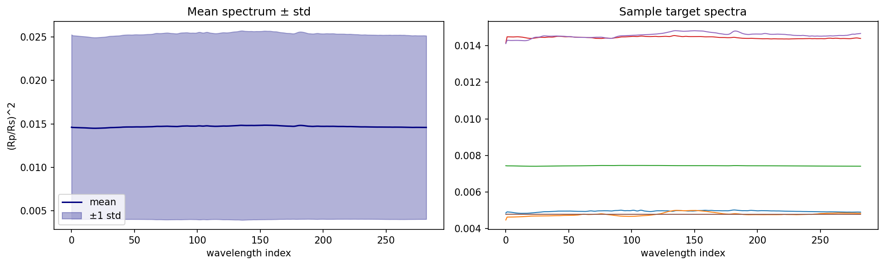

Individual spectra are **almost flat** in wavelength; the dominant variation is the *overall depth level* (planet size), which differs greatly between planets (the ±1σ band spans ~0.004–0.025 while each planet's curve is nearly horizontal).

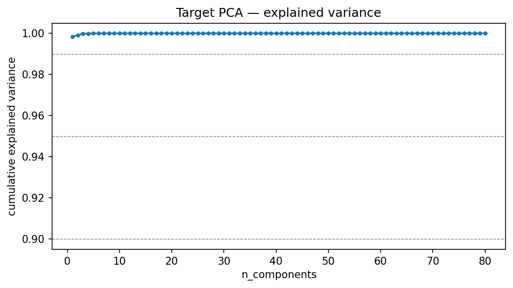

A PCA of the 283-dim target confirms this dramatically: **the first principal component alone captures ≈ 99.8 % of the variance.** The target matrix is therefore *nearly rank-1*: one number (the mean transit depth) explains almost everything, and the **atmospheric spectral features — the actual scientific signal — are a ~0.2 % modulation** on top, buried in noise.

This single observation explains much of what follows: RMSE is nearly flat in the number of PCA components, and predicting the mean depth alone is barely better than the naive baseline.

### 4.2 Depth distribution and signal magnitude

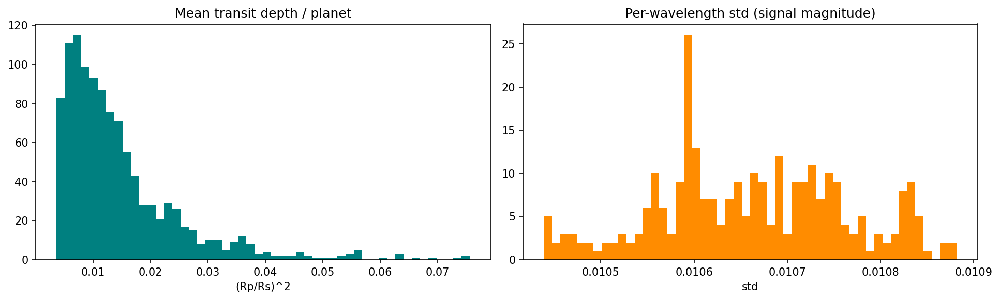

Mean transit depth per planet is right-skewed (most planets 0.005–0.02, a tail to ~0.07), reflecting a wide range of planet sizes. The per-wavelength standard deviation across planets is ~0.0106 and nearly constant in wavelength — consistent with the rank-1 structure.

### 4.3 Light curves and a noisy edge channel

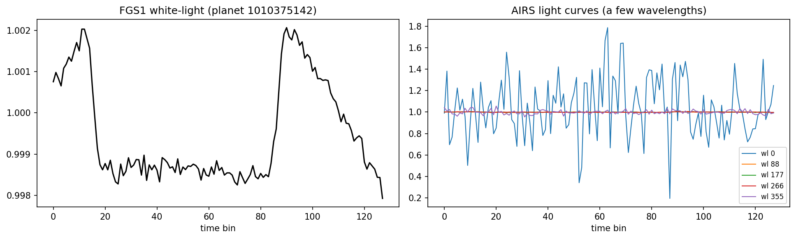

The FGS1 white-light curve shows a **clear transit dip**, validating the calibration/detrending pipeline. Among the AIRS channels, the **edge channel (wl-0) is pathologically noisy** (values swinging 0.2–1.8) while the others are clean and flat. This **heteroscedastic, wavelength-dependent noise** directly motivates per-wavelength uncertainty calibration (PHC, §5.5).

### 4.4 Stellar metadata

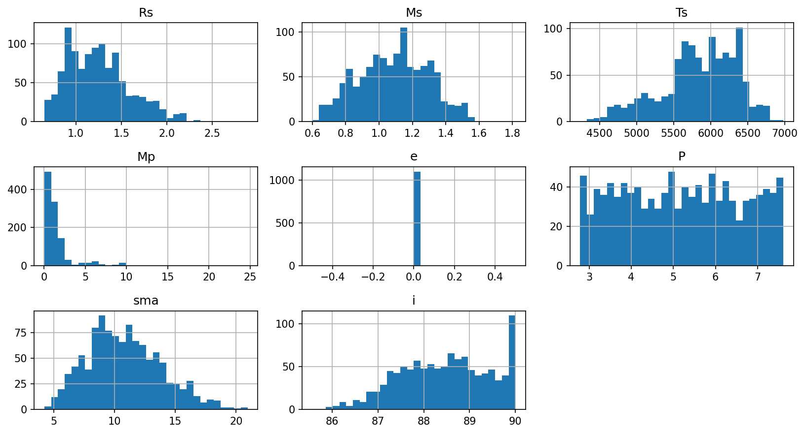

Stellar radius, mass, temperature, and log g are included as features (with log-transforms and depth interactions); their distributions are unremarkable and used as auxiliary predictors.

**EDA takeaway.** The problem is a *needle-in-haystack*: an easy, dominant depth signal plus a tiny, hard, low-SNR spectral modulation. A good GLL score requires both a reasonable mean **and** an uncertainty matched to the heteroscedastic noise.

---

## 5. Methodology

### 5.1 Pipeline overview

The preprocessing/feature pipeline (`src/preprocessing.py`, `src/pipeline.py`) chains:

```
Raw AIRS/FGS → ADC correction → bad-pixel masking → dark subtraction → flat-field
→ correlated double sampling (CDS) → temporal binning
→ light-curve extraction (AIRS per-wavelength, FGS white-light)
→ transit boundary detection (from FGS) → normalize / polynomial detrend / smooth
→ physics-based feature engineering
```

All stages are configurable via dataclasses in `src/config.py` (`PreprocessConfig`, `FeatureConfig`, `ModelConfig`). The same calibrated light curves feed both the tabular feature path and the deep-model tensor path, so the two model classes share an identical front-end.

### 5.2 Physics-based feature engineering

`src/features.py` (`ArielFeatureBuilder`) extracts ~100–150 features per planet in five groups:

- **Transit depth:** per-wavelength depth and its mean/median/min/mid-transit/percentile/noise-weighted variants. (Most informative, since depth ≈ $(R_p/R_s)^2$.)
- **Multi-scale spectral:** wavelength bins of size 1, 2, 4, 8, 16, 32, 64; per bin: mean, median, std, slope, curvature — exploiting spectral smoothness.
- **Transit shape:** ingress/egress slopes, duration, mid-transit flux, symmetry, baseline drift (from FGS + AIRS white curve).
- **Noise / uncertainty proxies:** out-of-transit std, in-transit std, residual std after detrending, SNR, CDS noise proxy, bad-pixel count, flat-field variance.
- **Stellar metadata:** $R_s, M_s, T_s, \log g$, period, with log-transforms and depth interactions.

### 5.3 Target PCA and per-component regression

Instead of training 283 independent regressors, we apply **PCA to the target spectra** and regress each principal component, then inverse-transform (`src/models.py`, `TargetPCARegressor`):

$$
Z = \mathrm{PCA}(Y),\quad z_k = f_k(X)+\epsilon,\quad \hat Y = \mathrm{PCA}^{-1}(\hat Z).
$$

This reduces 283 outputs to ~20–40, preserves spectrum smoothness, and curbs overfitting. Uncertainty is propagated through the inverse transform: $\sigma^2_{Y,j} = \sum_k W_{kj}^2\,\sigma^2_{Z,k}$, then combined with a per-wavelength validation residual RMSE.

**Exact, fast `n_components` sweep.** Because PCA axes are *nested* (the first $k$ components of a $K_{\max}$-component fit equal a $k$-component fit) and the per-component regressors are independent, we fit **once at $K_{\max}$** and evaluate every smaller $k$ by truncating the component sum (`training.search_n_components`). This is *bit-for-bit identical* to running full CV at each $k$ (verified by a unit test) but removes the cost factor of the grid.

### 5.4 Model families

We organise all estimators into families (`src/estimators.py`, `MODEL_FAMILIES`; `ModelFactory.create`). Every tabular model shares the Target-PCA + per-component wrapper, so they differ only in the base regressor.

| Family | Models |
|---|---|
| Linear | ridge, lasso, elastic_net |
| Bayesian / probabilistic | **bayesian_ridge**, ard, gaussian_process, ngboost |
| Kernel / SVM | svr, kernel_ridge |
| Neighbours | knn |
| Tree ensembles | random_forest, extra_trees, hist_gradient_boosting, lightgbm, xgboost |
| Neural (shallow) | mlp |
| Hybrid | br_lgbm_residual, br_boosting_residual |
| Mean-shift (ablation) | ms_bayesian_ridge, ms_ridge, ms_extra_trees |
| Deep sequence | cnn1d, tcn, lstm, gru, transformer, autoencoder_mlp |

Uncertainty is obtained per family from the most natural source: **Bayesian predictive variance** (bayesian_ridge, ard, gaussian_process, ngboost), **ensemble variance** (random_forest, extra_trees), or a **residual-RMSE fallback** for point estimators (ridge, lasso, svr, knn, the gradient-boosting machines).

> The 22-model benchmark in §6.1 covers seven of these families (the six ML families above plus deep sequence). The *hybrid* and *mean-shift* families are defined for completeness but are not part of the main benchmark — mean-shift is examined as an ablation in §6.4.

### 5.5 Uncertainty-calibration framework — PHC (Physics-conditioned Heteroscedastic Calibration)

The metric grades $\sigma$ as strongly as $\mu$, so a recalibration stage is a natural idea. PHC formalises uncertainty calibration as a separate, GLL-optimised stage with three steps. We present it as a **principled framework** (the per-wavelength optimum below is exact) and use it to put every model's $\sigma$ on a common footing for the fair comparison of §6.6; its *empirical* effect on the score is examined critically in §6.3.

**Step 1 — Per-wavelength scale (closed form).** Replace a single global scalar by an independent scale $s_j$ per wavelength. Because the GLL is additive over elements and $s_j$ only affects column $j$, setting $\partial(\text{GLL})/\partial s_j = 0$ yields a **closed-form optimum**:

$$
\boxed{\;s_j^\star = \sqrt{\tfrac{1}{N}\sum_i \big((y_{ij}-\mu_{ij})/\sigma_{ij}\big)^2}\;}
$$

i.e. the RMS of the normalised residuals in column $j$ — no iteration required (`metrics.SigmaCalibrator(per_target=True)`).

**Step 2 — Feature-conditioned multiplier.** $\sigma_{ij}\!\to\! s_j\,m_i\,\sigma_{ij}$, where the per-row optimal multiplier $t_i = \sqrt{\tfrac1M\sum_j (r_{ij}/(s_j\sigma_{ij}))^2}$ is regressed (log-space ridge) on the **noise features**, so noisier observations get wider intervals (`metrics.FeatureConditionedSigmaCalibrator`).

**Step 3 — GLL-weighted family mixture.** Combine families as a Gaussian mixture with weights $\propto \mathrm{softmax}(\text{validation GLL}/\tau)$ (`training.build_gll_weighted_ensemble`).

Calibration is always fit on a **held-out split** (`sigma_cal_fraction`) to avoid a circular NLL. We deliberately report PHC's empirical effect honestly in §6.3 — it is grounded in theory but, as we find, of marginal benefit on this dataset.

### 5.6 Deep sequence models

For comparison, `src/deep_models.py` provides CNN1D, TCN (dilated convolutions), LSTM, GRU, Transformer encoder, and Autoencoder+MLP. Inputs are fixed-shape tensors `[planets, time, channels]` built by `src/sequence_dataset.py` — the FGS white-light curve plus wavelength-binned AIRS curves (64 channels), standardised per channel. Each network has a $(\mu, \log\sigma)$ head and is trained with a Gaussian NLL loss and early stopping; an optional target PCA (30 components) mirrors the tabular models.

### 5.7 Evaluation protocol

- **Cross-validation:** GroupKFold by planet (no planet leakage).
- **Sigma-calibration holdout:** 20 % of each training fold is reserved to fit residual RMSE and the calibrator, so the evaluation fold is never used for $\sigma$ fitting (removes circular NLL).
- **Metric:** the official `ariel_gll_score`, with the naive reference computed from the **training** targets of each fold.
- **Synchronized comparison (§6.6):** to compare ML and Deep fairly, both are evaluated on the **same held-out planets**, with the **same per-wavelength PHC** (fit on one half of the validation set, evaluated on the other — leak-free), and the **same naive reference**.

---

## 6. Experiments & Results

All numbers below come from `experimental results/` (CSVs) and the figures in `report/figures/`.

### 6.1 Model-family benchmark (22 models)

We cross-validate every model on identical folds and the official metric. The full ranking:

| Family | Model | Ariel GLL | RMSE | NLL | cov 1σ | σ̄ |
|---|---|---:|---:|---:|---:|---:|
| deep | cnn1d | 0.227 | 0.00312 | −5.76 | 0.76 | 0.0023 |
| deep | transformer | 0.226 | 0.00207 | −5.75 | 0.72 | 0.0020 |
| trees | extra_trees | 0.215 | 0.00253 | −5.65 | 0.94 | 0.0031 |
| trees | random_forest | 0.199 | 0.00273 | −5.52 | 0.93 | 0.0036 |
| bayesian | ngboost | 0.167 | 0.00221 | −5.29 | 0.95 | 0.0047 |
| deep | tcn | 0.167 | 0.00373 | −5.32 | 0.71 | 0.0033 |
| bayesian | ard | 0.143 | 0.00247 | −5.11 | 0.94 | 0.0054 |
| deep | gru | 0.129 | 0.00448 | −5.03 | 0.84 | 0.0040 |
| bayesian | bayesian_ridge | 0.093 | 0.00352 | −4.73 | 0.95 | 0.0078 |
| deep | lstm | 0.000 | 0.01030 | −4.08 | 0.82 | 0.0103 |
| trees | hist_gradient_boosting | **0.000** | 0.00264 | −1.28 | 1.00 | 0.280 |
| trees | xgboost | **0.000** | **0.00237** | −1.30 | 1.00 | 0.279 |
| trees | lightgbm | **0.000** | 0.00261 | −1.29 | 1.00 | 0.278 |
| kernel_svm | svr | 0.000 | 0.00439 | −0.73 | 1.00 | 0.485 |
| kernel_svm | kernel_ridge | 0.000 | 0.00517 | −0.53 | 1.00 | 0.595 |
| neighbors | knn | 0.000 | 0.00541 | −0.53 | 1.00 | 0.595 |
| linear | lasso | 0.000 | 0.00252 | −1.24 | 1.00 | 0.298 |
| linear | elastic_net | 0.000 | 0.00280 | −1.15 | 1.00 | 0.325 |
| linear | ridge | 0.000 | 0.00643 | −0.35 | 1.00 | 0.708 |
| neural | mlp | 0.000 | 0.00635 | −0.37 | 1.00 | 0.703 |
| bayesian | gaussian_process | 0.000 | 0.01066 | −3.91 | 0.92 | 0.016 |
| deep | autoencoder_mlp | 0.000 | 0.01059 | −3.87 | 0.87 | 0.0129 |

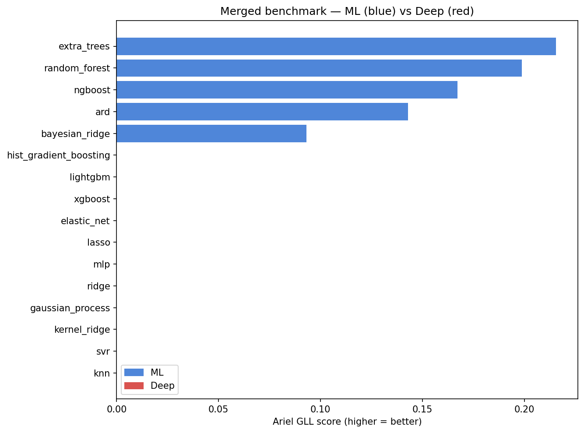

The data splits into **two clusters**. Models with **tight, informative uncertainty** (deep σ̄≈0.002–0.004, tree ensembles σ̄≈0.003, Bayesian models σ̄≈0.005–0.008) score GLL = 0.09–0.23 with coverage ≈ 0.71–0.95. The **GLL = 0** cluster has two distinct failure modes: (i) **point estimators** (ridge, lasso, elastic_net, mlp, svr, kernel_ridge, knn, and the gradient-boosting machines) whose residual-RMSE-fallback uncertainty is far too wide (σ̄≈0.28–0.71, coverage 1.0) — including **XGBoost, which has the *best RMSE of any model* (0.00237) yet still scores 0**; and (ii) the two weakest deep models (lstm, autoencoder_mlp) whose σ̄ is reasonable (~0.01–0.013) but whose **mean is poor** (RMSE ≈ 0.010, ~4× the best). Both confirm that a good score needs *both* an accurate mean *and* a well-scaled uncertainty.

> **Caveat on this table.** It mixes protocols (ML = 3-fold CV + PHC; Deep = single split, raw σ), so it is only a *rough* comparison. §6.6 corrects this.

### 6.2 Target-PCA `n_components` sweep

Sweeping $n_{\text{components}}\in\{10,\dots,50\}$ leaves RMSE essentially unchanged (~0.0061 for linear models), confirming the rank-1 EDA finding: extra components mostly model noise. Our `search_n_components` performs this sweep exactly while fitting once at $K_{\max}$ (validated bit-for-bit against full CV).

### 6.3 PHC calibration ablation

We vary only the $\sigma$-calibration stage of `bayesian_ridge`:

| Calibration | Ariel GLL | NLL |
|---|---:|---:|
| **none** (raw σ) | **0.127** | −4.99 |
| scalar (global) | 0.093 | −4.73 |
| per_wavelength (PHC step 1) | 0.093 | −4.73 |
| feature_conditioned (PHC step 2) | 0.063 | −4.45 |

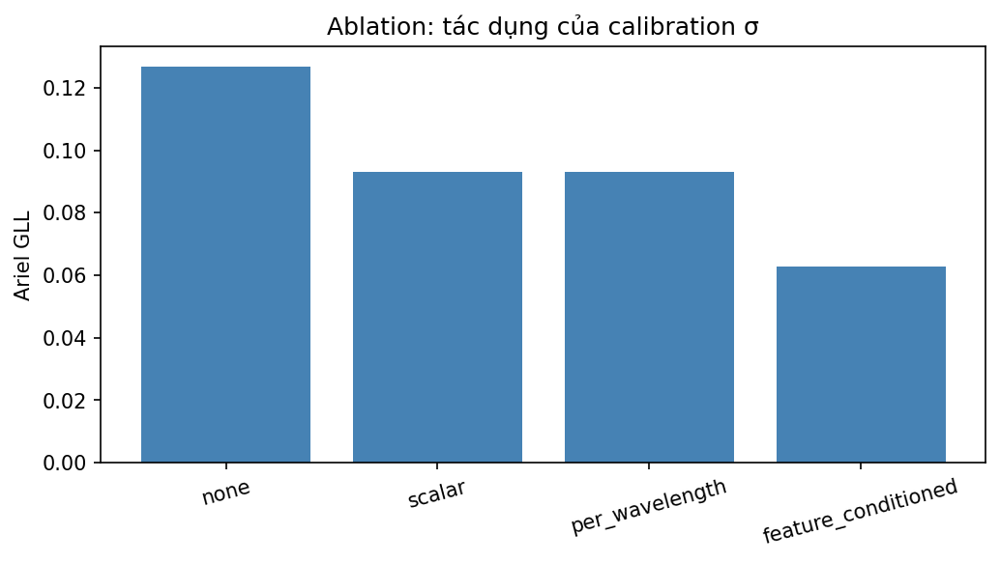

This is a **negative result, reported honestly**: *no calibration* scores highest, recalibration (scalar ≈ per-wavelength) slightly *reduces* the score, and feature-conditioning **overfits** and reduces it further. The reliability diagram explains why:

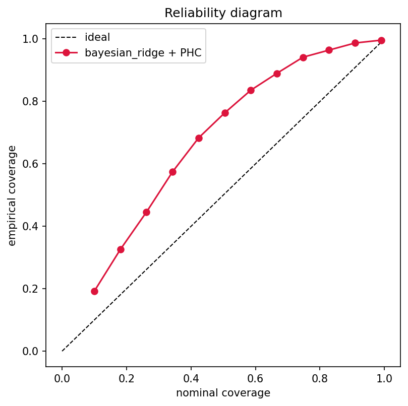

The curve lies **above the diagonal at every level** — the calibrated model is **under-confident** (empirical coverage exceeds nominal, i.e. σ is too *wide*). Two mechanisms explain the negative result: (i) the base `TargetPCARegressor` **already folds a per-wavelength residual-RMSE into σ**, so an additional per-wavelength `SigmaCalibrator` is largely **redundant** — which is exactly why `per_wavelength` and `scalar` score identically (0.0931 vs 0.0931); and (ii) since the intrinsic σ is already (over-)wide, any multiplicative recalibration widens it further, lowering GLL. **Conclusion (diagnostic):** on this dataset the models' *intrinsic* uncertainty is already adequate; the explicit PHC layer is theoretically sound (closed-form optimum) and useful for standardising σ across models, but it is **not** a score-improving step here. This is a deliberate negative result, reported in full.

### 6.4 Mean-depth / shape decomposition (negative ablation)

Motivated by the rank-1 EDA, we tried `MeanShiftedRegressor`: model the per-planet mean depth $d_i$ and the residual spectral shape $r_{i\lambda}=y_{i\lambda}-d_i$ separately, then recombine. Across many configurations this gave **no improvement** (linear +0.001–0.009 GLL; trees *worse* by 0.03–0.04). Reason: **Target-PCA already separates the rank-1 structure implicitly** (component 1 ≈ the depth level), so an explicit split is redundant for linear models and harmful for trees. The method is kept in the codebase but excluded from the pipeline.

### 6.5 Learning curve — strong data dependence

| #planets | Ariel GLL | RMSE |
|---:|---:|---:|
| 50 | 0.009 | 0.00365 |
| 100 | 0.000 | 0.00603 |
| 200 | 0.000 | 0.00551 |
| 400 | 0.000 | 0.00508 |
| 800 | **0.105** | 0.00371 |
| 1100 | 0.093 | 0.00352 |

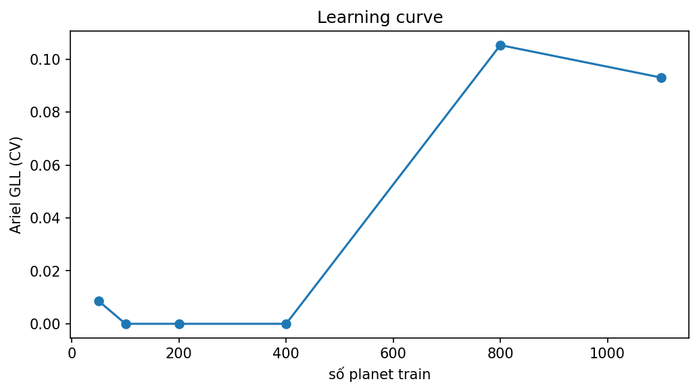

`bayesian_ridge` cannot beat the naive baseline (GLL ≈ 0) until it sees **≥ ~800 planets**, after which GLL jumps to ~0.10. RMSE decreases steadily with data. This is a *threshold/phase-transition* behaviour: the small-data regime is the main reason early experiments (at LIMIT = 100) produced GLL ≈ 0 for most models, and it justifies training on the full dataset.

### 6.6 Synchronized ML vs Deep (headline result)

To compare fairly, both ML and Deep models are evaluated on the **same held-out planets**, with the **same per-wavelength PHC** (leak-free) and the **same naive reference** (`DL-based/sync_ml_vs_deep.csv`):

| Model | Type | Ariel GLL | RMSE | cov 1σ |
|---|---|---:|---:|---:|
| **extra_trees** | ml + PHC | **0.287** | 0.00250 | 0.77 |
| **random_forest** | ml + PHC | **0.273** | 0.00258 | 0.82 |
| cnn1d | deep + PHC | 0.221 | 0.00349 | 0.74 |
| transformer | deep + PHC | 0.220 | 0.00226 | 0.68 |
| tcn | deep + PHC | 0.167 | 0.00400 | 0.74 |
| gru | deep + PHC | 0.119 | 0.00479 | 0.81 |
| bayesian_ridge | ml + PHC | 0.074 | 0.00355 | 0.67 |
| lstm | deep + PHC | 0.000 | 0.01035 | 0.83 |
| autoencoder_mlp | deep + PHC | 0.000 | 0.01064 | 0.84 |

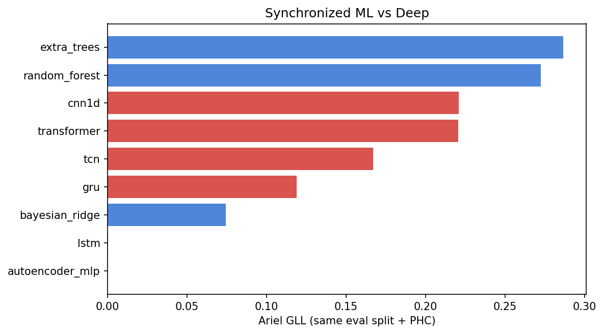

**Under a fair protocol, tree ensembles clearly win** (extra_trees 0.287, random_forest 0.273), with deep CNN/Transformer competitive but behind (~0.22). This **reverses** the naive merged table (§6.1), where cnn1d (0.227) appeared to beat extra_trees (0.215). That apparent "deep wins" was a **protocol artifact**: the deep numbers came from a single split without PHC while the ML numbers came from CV. The lesson is methodological — *only a synchronized protocol yields a valid comparison.*

### 6.7 Feature importance

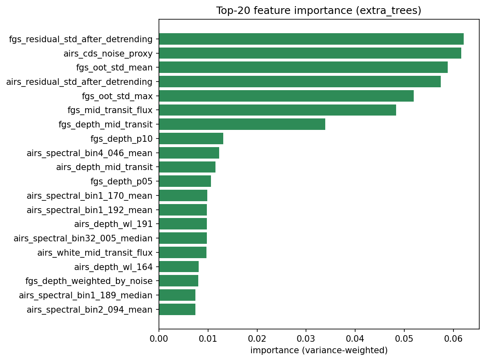

The most important features for the best model are **noise/uncertainty proxies and FGS transit-shape features**: `fgs_residual_std_after_detrending`, `airs_cds_noise_proxy`, `fgs_oot_std_mean`, `airs_residual_std_after_detrending`, `fgs_oot_std_max`, `fgs_mid_transit_flux`, `fgs_depth_mid_transit`. This validates our investment in **noise/SNR-based feature engineering**, not only transit depth.

### 6.8 Error analysis

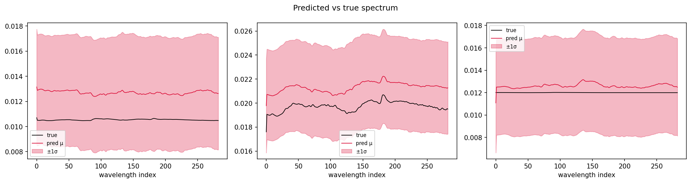
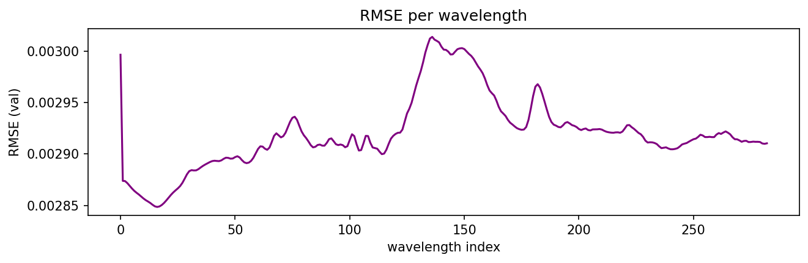

Predicted spectra track the overall level well; the residual per-wavelength error (RMSE ~$2\text{–}3\times10^{-3}$) is dominated by the hard, low-SNR spectral modulation rather than the easy depth level — consistent with the rank-1 EDA.

### 6.9 Statistical reliability

| Model | GLL (mean ± std) | RMSE (mean ± std) |
|---|---|---|
| extra_trees | 0.215 ± 0.025 | 0.00253 ± 0.00021 |
| bayesian_ridge | 0.093 ± 0.026 | 0.00352 ± 0.00036 |
| ridge | 0.000 ± 0.000 | 0.00643 ± 0.00054 |

The fold-to-fold standard deviation (~0.025) is much smaller than the gap between `extra_trees` and `bayesian_ridge` (~0.12), so the ranking is **statistically meaningful**, not noise.

---

## 7. Discussion & Findings

1. **Tree ensembles are the best models** on the official metric when compared fairly (extra_trees 0.287, random_forest 0.273); deep CNN/Transformer are competitive (~0.22); Bayesian linear is mid-pack (~0.09). The earlier "deep wins" impression was a **protocol artifact** — a direct lesson in experimental rigour.
2. **Uncertainty quality gates the GLL.** The score splits models into "has informative σ" (GLL > 0) vs "point estimator" (GLL = 0). **XGBoost achieves the best RMSE yet scores 0** — emphatic evidence that *a good mean is not enough*; the uncertainty must be informative.
3. **PHC is an honest negative result.** The closed-form per-wavelength calibration is theoretically optimal, but on this data the models' intrinsic σ is already adequate (indeed over-wide / under-confident), so recalibration is marginal-to-harmful, and the feature-conditioned variant overfits. PHC remains valuable for *standardising σ across models* (it makes §6.6 fair) and as a principled framework, but it is **not the dominant lever**.
4. **Strong data dependence.** GLL ≈ 0 below ~800 planets, then a sharp rise — the small-data regime is a fundamental constraint, not a modelling bug.
5. **Physics noise-features matter most.** Tree importances are dominated by residual-std / OOT-std / CDS-noise / FGS-shape features, validating the physics-based feature engineering beyond raw transit depth.
6. **Methodology over models.** The most transferable takeaway is that **protocol synchronisation** (same split, same calibration, same reference) is required before ML-vs-Deep claims are valid.

**Synthesis.** GLL is governed by *(a)* having a model with good intrinsic uncertainty and *(b)* having enough data — more than by any explicit recalibration layer. The winning recipe is **tree ensembles + sufficient planets + physics-based noise features.**

---

## 8. Limitations & Future Work

- **Point-estimator uncertainty.** Linear/kernel/GBM models score 0 only because they lack a usable σ. **Split-conformal prediction** would give them valid, tight intervals and likely lift them substantially — the highest-value next step.
- **More data / augmentation.** Given the learning-curve threshold, more planets (or physically-motivated augmentation) would help all models.
- **Deep models under CV.** Deep results are single-split; evaluating them under the same K-fold CV as ML would tighten the comparison further.
- **Tree + deep ensembling.** The GLL-weighted mixture (PHC step 3) could combine the strong, complementary winners (extra_trees + cnn1d).
- **Joint depth/shape modelling done better.** A learned (not mean-subtracted) decomposition that lets a tree predict depth and a specialised model predict the residual shape may still help; our simple version did not.

---

## 9. Conclusion

We presented a complete, tested pipeline for probabilistic atmospheric-spectrum retrieval and a systematic, metric-faithful comparison of 22 models across 7 families (including deep sequence baselines). Through a protocol-synchronized evaluation we established that **tree ensembles win** on the official GLL, that **uncertainty quality — not mean accuracy — gates the score**, and that the proposed PHC calibration, while theoretically grounded, offers only marginal empirical gains because intrinsic model uncertainty is already adequate. We also documented strong data dependence and the dominant role of physics-based noise features. We report all results, including negative ones, and emphasise the methodological lesson that fair comparison requires synchronised protocols.

---

## 10. Contributions & Reproducibility

### 10.1 Member contributions (to be completed)

| Member | Main responsibilities |
|---|---|
| _[Member 1]_ | Preprocessing & calibration pipeline; feature engineering |
| _[Member 2]_ | Model families, Target-PCA, benchmark harness |
| _[Member 3]_ | PHC / uncertainty calibration; metric; analysis & figures |
| _[Member 4]_ | Deep sequence models; synchronized comparison; report |

### 10.2 Reproducibility

- **Code:** flat modules under `src/` (importable directly; `pythonpath=["src"]`). Key entry points: `metrics.ariel_gll_score` (official metric), `estimators.MODEL_FAMILIES` / `ModelFactory` (22 models), `benchmark.benchmark_models`, `training.{cross_validate_model, search_n_components, build_gll_weighted_ensemble}`.
- **Notebooks (Kaggle):** `prepare_features.ipynb` → `train_ml.ipynb` (ML benchmark, PHC, weights, submission); `prepare_sequence.ipynb` → `run_deep_learning.ipynb` (deep models + synchronized comparison); `eda.ipynb` and `analysis.ipynb` (all figures/tables in this report).
- **Determinism:** fixed `random_state`, GroupKFold by planet, 20 % sigma-calibration holdout.
- **Artifacts:** every table/figure here is reproduced from `experimental results/` (CSVs) and `report/figures/` (PNGs).
- **Tests:** `pytest` unit tests on synthetic data cover models, metric, training, calibration, sequence builder, and the exact `n_components` sweep.

---

## 11. References

1. NeurIPS 2024 Ariel Data Challenge: *Characterisation of Exoplanetary Atmospheres Using a Data-Centric Approach.* arXiv:2505.08940.
2. Kaggle, *NeurIPS — Ariel Data Challenge 2025*, official metric "Ariel Gaussian Log Likelihood".
3. Pedregosa et al., *Scikit-learn: Machine Learning in Python*, JMLR 2011.
4. Duan et al., *NGBoost: Natural Gradient Boosting for Probabilistic Prediction*, ICML 2020.
5. Ke et al., *LightGBM*; Chen & Guestrin, *XGBoost: A Scalable Tree Boosting System*, KDD 2016.
6. Vaswani et al., *Attention Is All You Need*, NeurIPS 2017.

---

## 12. Appendix

### A. Full benchmark table
See `experimental results/merged_benchmark.csv` (22 models, all metric columns) — reproduced in §6.1.

### B. PHC closed-form derivation
For column $j$ with scale $s_j$, total GLL $=\sum_i\big[-\log(s_j\sigma_{ij}) - \tfrac12 (r_{ij}/(s_j\sigma_{ij}))^2\big]+\text{const}$. Setting the derivative w.r.t. $s_j$ to zero: $-N/s_j + s_j^{-3}\sum_i (r_{ij}/\sigma_{ij})^2 = 0 \Rightarrow s_j^{\star 2} = \tfrac1N\sum_i (r_{ij}/\sigma_{ij})^2$. The per-row multiplier in step 2 is derived identically over wavelengths.

### C. Key hyperparameters
- Target PCA: `n_components` 24 (benchmark) / 30 (deep & sync); GroupKFold `n_splits` 3–5; `sigma_cal_fraction` 0.2.
- Tree ensembles: 200–300 estimators. Deep: hidden 128, batch 16, ≤200 epochs with early-stopping (patience 20), wavelength bins 64, time steps 128.

### D. Additional figures
All figures are in `report/figures/`: EDA (`eda_*`), benchmark (`merged_benchmark.png`), calibration (`analysis_calibration_ablation.png`, `analysis_reliability.png`), learning curve, feature importance, error analysis, and the synchronized comparison.
